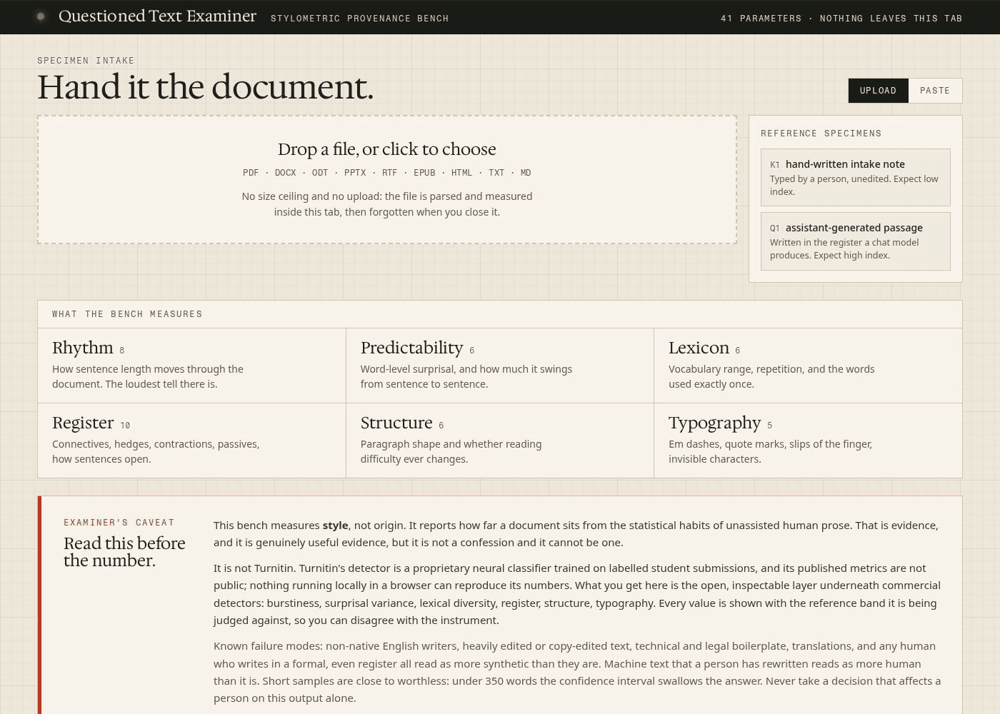
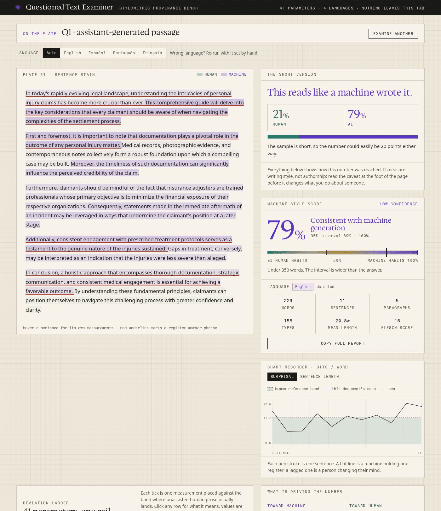

# Questioned Text Examiner

A local, inspectable stylometric bench for the question "was this document written by a person?"

It reads a file in your browser, measures **41 stylometric parameters** across six families, and reports each one next to the reference band where unassisted human prose usually lands. Nothing is uploaded, no API key is needed, and there is no size ceiling: the file is parsed and measured in the tab, then forgotten when you close it.

Works in **English, Spanish, Portuguese and French**. It opens with a plain-language verdict ("This reads like a person wrote it") and a **human / AI percentage split**, then shows every measurement that produced it. The confidence interval widens honestly on short samples, and documents that are not really prose are flagged as unscorable.



## What it is not

It is **not Turnitin, ZeroGPT, GPTZero or QuillBot**. Those are proprietary neural classifiers trained on labelled submissions and served from someone else's machine; their metrics are not published and cannot be reproduced locally. A well-trained classifier will usually beat hand-built stylometry on raw accuracy.

What this gives you instead is the open layer underneath commercial detectors: every value visible, every reference band visible, every weight visible, running on your own machine. You can disagree with the instrument, which is the entire point.

**This measures style, not origin.** It reports how far a document sits from the statistical habits of unassisted human prose. That is evidence. It is not a confession, and it cannot be one.

### Known failure modes

- Non-native writers score as more synthetic than they are.
- So do heavily copy-edited text, technical and legal boilerplate, and translations.
- So does any human who writes in a formal, even register.
- Machine text a person has rewritten scores as more human than it is.
- Under 350 words the confidence interval swallows the answer. Under 120 words the output is noise.
- Spanish, Portuguese and French bands are informed priors, not corpus-fitted like the English ones. Treat those scores as directional.

Never take a decision that affects a person on this output alone.

## Quick start

```bash
npm install
npm run dev      # http://localhost:5173
npm run build    # static site in dist/
```

## Deploying

Whatever host you use, the one rule is: **serve `dist/`, never the repo root.** `index.html` at the root points at `/src/main.jsx`, which only Vite's dev server can compile. Serving the root gives you a page with the right title and nothing else on it.

### Cloudflare Workers

`wrangler.jsonc` is included and points at `./dist`. Either run `npm run deploy` locally, or in the dashboard set:

- **Build command:** `npm run build`
- **Deploy command:** `npx wrangler deploy`
- **Environment variable:** `NODE_VERSION` = `22`

### Cloudflare Pages

- **Build command:** `npm run build`
- **Build output directory:** `dist`
- **Environment variable:** `NODE_VERSION` = `22`

### GitHub Pages

The included workflow publishes `dist/` on every push to `main`. Enable it under **Settings → Pages → Build and deployment → Source: GitHub Actions**.

### Blank page checklist

1. View source on the deployed URL. If you see `<script type="module" src="/src/main.jsx">`, the repo root is being served: fix the build command and output directory.
2. If the console shows 404s on `/assets/*.js`, it is a base-path problem. `vite.config.js` already sets `base: "./"`, which covers subpath hosting.
3. If the console shows a bare MIME-type error on a `.jsx` file, same cause as (1).

## Supported input

Drag in a file or paste text directly.

| Format | Notes |
| --- | --- |
| `.pdf` | Own extractor: object table, PDF 1.5+ object streams, per-font `/ToUnicode` CMaps, paragraph recovery from vertical text-matrix jumps. Scanned PDFs with no text layer are rejected rather than guessed at; run OCR first. |
| `.docx`, `.pptx`, `.odt`, `.epub` | ZIP inflate via the browser's native `DecompressionStream`, then XML text extraction (including headers, footers, footnotes for `.docx`). |
| `.rtf` | Control-word stripping with `\uN` and hex escape decoding. |
| `.html`, `.htm` | Parsed with `DOMParser`; scripts and styles removed. |
| `.txt`, `.md`, `.csv`, `.log`, `.tex`, `.json` | Read as a stream, so very large files never land in memory twice. |
| `.doc` | Legacy binary: approximate salvage only, and typography signals are flagged unreliable. |

## Languages

| Language | Code | Calibration |
| --- | --- | --- |
| English | `en` | primary |
| Spanish (Español) | `es` | secondary |
| Portuguese (Português) | `pt` | secondary |
| French (Français) | `fr` | secondary |

The language is detected automatically from stop-word hit rates plus diacritic and orthography tiebreakers, and can be pinned by hand when detection is wrong. Each pack in `src/engine/languages/` carries its own:

- rank-ordered frequency lexicon (drives the surprisal model)
- function words, first-person forms, abbreviations (drives segmentation and rate signals)
- discourse markers, register markers, hedges, intensifiers
- syllable-counting rules (Spanish diphthong/hiatus handling, French silent endings)
- passive-voice pattern, including the reflexive `se` passive in Spanish and Portuguese
- readability formula: Flesch for English, Fernández Huerta for Spanish and Portuguese, Kandel–Moles for French
- reference-band overrides, since Spanish and Portuguese sentences run longer and drop subject pronouns

Signals that carry no information in a language are **held neutral** for it. Contractions are the clear case: `al`, `del`, `do`, `na` and French elision are grammatically mandatory, so they say nothing about who wrote the document.

**A document in a language that is not calibrated is refused, not scored.** Detection covers Italian, German, Dutch, Catalan, Polish, Russian, Turkish and Swedish plus non-Latin scripts purely so it can name the language and decline. Producing a confident number against the wrong reference bands would be worse than producing nothing.

Adding a language means writing one file in `src/engine/languages/`, registering it in `index.js`, and adding its stop-word vote list to `VOTES`.

## How the index works

1. **Segment.** Sentence splitting guards against abbreviations, initials, decimals and mid-sentence periods. Paragraphs fall back to single newlines when the document has no blank lines.
2. **Measure.** 41 parameters, listed below.
3. **Standardise.** Each parameter becomes a signed deviation, `dev = dir × (value − center) / spread`, where `dir` is `+1` when a higher value is evidence of machine generation.
4. **Hold what cannot be trusted.** Parameters needing a bigger sample than the specimen gives (Zipf slope under 600 words, repeated 5-grams under 300, readability σ without three real paragraphs, and so on) are measured and displayed but **held neutral**, with weight zero. They are not allowed to invent evidence.
5. **Combine.** A weighted mean of the clamped deviations becomes a logit, then `index = σ(1.55 × logit)` on 0–1.
6. **Bound it.** The 95% interval half-width is `0.52 / √(1 + words/220) + 0.035`, so short samples visibly refuse to commit.
7. **Report it.** The index is presented as a percentage (`index × 100`) and its human complement, with the 0–1 value kept in the copyable report.
8. **Check eligibility.** Bulleted lines, tiny paragraphs, sentence fragments and missing terminal punctuation are counted. Two or more symptoms marks the document as non-prose: outlines and checklists score human almost automatically, whoever wrote them, so the app says so instead of letting the number stand.

### The surprisal model

There is no language model here and no network call, so perplexity is approximated with a **Zipf–Mandelbrot unigram model**: `p(rank) = C / (rank + 2.7)^1.07` over the active language's rank-ordered lexicon, with out-of-vocabulary tokens assigned an effective rank from their length. Surprisal is `−log₂ p(word)`.

This is a proxy, not a transformer's perplexity. What survives the approximation is the part that actually discriminates: **the variance of surprisal from sentence to sentence.** Generated prose holds one register; people do not.

## The 41 parameters

### Rhythm (8)

| Parameter | Unit | Human band | Reads machine when |
| --- | --- | --- | --- |
| Burstiness | CV | 0.460 – 0.780 | lower |
| Sentence length σ | words | 6.00 – 12.0 | lower |
| Sentence length μ | words | 12.5 – 25.5 | higher |
| Length kurtosis | — | 2.20 – 6.20 | lower |
| Length skew | — | 0.300 – 1.40 | lower |
| Short sentences | < 8 words | 0.070 – 0.250 | lower |
| Long sentences | > 35 words | 0.030 – 0.150 | lower |
| Mid-band concentration | 15–28 words | 0.230 – 0.450 | higher |

### Predictability (6)

| Parameter | Unit | Human band | Reads machine when |
| --- | --- | --- | --- |
| Mean surprisal | bits/word | 9.50 – 11.7 | lower |
| Surprisal variance | bits | 1.00 – 1.90 | lower |
| Surprisal spikes | share | 0.070 – 0.190 | lower |
| Longest flat run | sentences | 2.00 – 5.20 | higher |
| Out-of-list words | share | 0.180 – 0.360 | lower |
| Zipf slope deviation | |Δs| | 0.080 – 0.240 | lower |

### Lexicon (6)

| Parameter | Unit | Human band | Reads machine when |
| --- | --- | --- | --- |
| MATTR (w=50) | — | 0.680 – 0.800 | higher |
| Hapax legomena | share | 0.350 – 0.530 | lower |
| Yule's K | — | 70.0 – 140 | higher |
| Word-length entropy | bits | 2.13 – 2.57 | lower |
| Function-word rate | share | 0.440 – 0.530 | higher |
| Repeated 5-grams | share | -0.002 – 0.018 | higher |

### Register (10)

| Parameter | Unit | Human band | Reads machine when |
| --- | --- | --- | --- |
| Discourse markers | per 1k | 3.00 – 10.0 | higher |
| Register markers | per 1k | 0.000 – 2.40 | higher |
| Hedges | per 1k | 8.00 – 20.0 | higher |
| Contractions | per 1k | 1.00 – 13.0 | lower |
| First person | per 1k | 4.00 – 32.0 | lower |
| Intensifiers | per 1k | 3.00 – 11.0 | lower |
| Passive constructions | share of sent. | 0.090 – 0.290 | higher |
| ! and ? endings | share of sent. | 0.010 – 0.130 | lower |
| Opener repetition | share | 0.130 – 0.310 | higher |
| Opener entropy | bits | 1.25 – 1.95 | lower |

### Structure (6)

| Parameter | Unit | Human band | Reads machine when |
| --- | --- | --- | --- |
| Paragraph length CV | — | 0.350 – 0.750 | lower |
| Readability σ | FK grades | 1.50 – 3.30 | lower |
| Flesch reading ease | — | 36.0 – 68.0 | lower |
| List scaffolding | share of lines | -0.030 – 0.150 | higher |
| Markup residue | per 1k | -0.700 – 1.30 | higher |
| Sentences per paragraph CV | — | 0.320 – 0.720 | lower |

### Typography (5)

| Parameter | Unit | Human band | Reads machine when |
| --- | --- | --- | --- |
| Em dashes | per 1k | -0.400 – 2.80 | higher |
| Quote consistency | — | 0.150 – 0.850 | higher |
| Double space after period | share | -0.060 – 0.180 | lower |
| Slip rate | per 1k | 0.000 – 4.00 | lower |
| Invisible characters | per 1k | -0.350 – 0.450 | higher |

Click any row in the app for the reasoning behind that parameter, the observed value, the band, and its weight.

## Reading the output



- **The short version** — one sentence, a human/AI percentage split, and a plain statement of how much the sample can bear. If the document is a list rather than prose, this is where it says to ignore the number.
- **Machine-style score** — the same percentage with a sample-size confidence interval and a plain-language band, from "consistent with human authorship" to "consistent with machine generation".
- **Sentence stain plate** — every sentence tinted by its own score; hover for its word count, surprisal, deviation from the document mean, and marker hits. Red underline marks a register-marker phrase.
- **Chart recorder** — surprisal (or sentence length) per sentence against the human band, with the document's own mean. The flat-versus-jagged read is the fastest signal in the whole app.
- **Deviation ladder** — all 41 parameters as ticks on one rail, grouped by family, with held-neutral rows called out.
- **Copy full report** — a plain-text report with every value, band, deviation, marker hit and repeated 5-gram, plus the caveat, suitable for pasting into a case file.

## Project layout

```
src/
  App.jsx              layout, header, empty state, examiner's caveat
  engine/
    analyze.js         segmentation, all 41 measurements, scoring, hold rules
    surprisal.js       Zipf–Mandelbrot unigram surprisal model
    extract.js         PDF, ZIP-based Office, RTF and HTML text extraction
    samples.js         labelled reference specimens, two per language
    languages/
      index.js         pack compilation, language detection
      en.js es.js pt.js fr.js
  ui/
    Intake.jsx         drop zone, paste mode, progress, specimen buttons
    Verdict.jsx        score, interval, language, corpus stats, report builder
    Trace.jsx          chart recorder
    PlainReading.jsx   one-sentence verdict, human/AI split, shape warning
    Ladder.jsx         deviation ladder
    Plate.jsx          sentence stain plate
    Findings.jsx       drivers, held-neutral list, marker hits, raw values
```

Tuning the instrument means editing `SIGNAL_SPEC` in `src/engine/analyze.js`: each entry carries its own `center`, `spread`, direction and weight, and the UI derives everything else from that array. Per-language deviations live in each pack's `bands` and `holds`.

## Calibration

The reference bands are informed priors, not the output of a labelled corpus study. If you have your own labelled sets, recentre `SIGNAL_SPEC` (and the per-language `bands`) on them and the whole instrument sharpens: that is the intended way to use this repo.

Sanity check on the bundled specimens: English 40% / 79%, Spanish 43% / 82% for the typed note versus the assistant-written passage. Clear separation, and nowhere near the certainty a commercial detector will claim.

## License

MIT. See [LICENSE](LICENSE).
